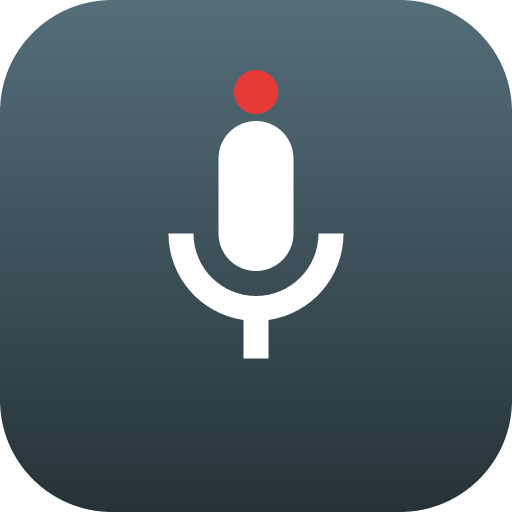

# Recorder

**A private, secure personal voice recorder for Android.** Record hands-free in the
background, start in one tap, keep your recordings behind a biometric lock, and back
them up to a private Google Drive folder.

<p align="center">
  
</p>

---

## What it does

- 🎙️ **Background recording** — a microphone foreground service keeps recording while
  the app is closed, the screen is off, and through Doze. Audio is split into
  15-minute segments so a crash costs you at most one segment. An **opt-in
  "auto-start when the app opens"** setting makes it begin recording the moment you
  launch/unlock the app, for a hands-off always-on workflow.
- 🗣️ **Voice-optimized** — mono AAC (`.m4a`) at 16 kHz / 64 kbps: clear speech, small files.
- ⚡ **One-tap start/stop** — a Quick Settings tile and a home-screen shortcut start
  recording without opening the app.
- 🔒 **Biometric lock** — the app (playback, list, settings, Drive) is gated by
  `BiometricPrompt` (fingerprint/face, or device PIN as fallback). The window is
  `FLAG_SECURE`, so recordings can't be screenshotted or previewed in Recents.
- ☁️ **Google Drive backup** — uploads to the private **appDataFolder** (invisible in
  your normal Drive), with Wi-Fi-only, auto-upload, and delete-after-upload options.
- 🎨 Jetpack Compose UI with Material 3 dynamic color.

## Not a spy tool — by design

This is a recorder for **your own** conversations and notes. It deliberately does
**not** hide, and could not even if it tried:

- **No hidden icon, no invisible recording.** Android *requires* a persistent
  notification for any background microphone use (since Android 9), shows a mandatory
  green mic indicator (Android 12+), and removed launcher-icon hiding (Android 8+).
  Google Play bans stalkerware and icon-hiding outright.
- "Private" here means **protected from other people who pick up your phone**
  (biometric lock, secure window, private cloud folder) — never *hidden from the
  person being recorded*.

Recording people without their consent may be illegal where you live. Please don't.

## Build

Native Kotlin + Gradle. Requires the Android SDK and JDK 17.

```powershell
git clone https://github.com/shivarya/voice-recorder.git
cd voice-recorder
# set your SDK path (create local.properties):  sdk.dir=C:\\path\\to\\Android\\Sdk
.\gradlew.bat assembleDebug
adb install -r app\build\outputs\apk\debug\app-debug.apk
```

Versions: AGP 8.7.3 · Kotlin 2.0.21 · Gradle 8.14.3 · compileSdk 35 · minSdk 31 · targetSdk 35.

## Google Drive setup

Drive backup needs a one-time Google Cloud OAuth client (package name + signing
SHA-1). Full walkthrough: **[DRIVE_SETUP.md](DRIVE_SETUP.md)**.

## Architecture

| Piece | File |
|---|---|
| Recording foreground service (segments, notification) | `service/RecordingService.kt` |
| `MediaRecorder` wrapper (voice AAC) | `audio/Recorder.kt` |
| One-tap trampoline (tile / shortcut / boot) | `QuickRecordActivity.kt` |
| Quick Settings tile | `tile/RecordTileService.kt` |
| Post-reboot tap-to-resume | `service/BootReceiver.kt` |
| Biometric gate | `security/BiometricGate.kt` |
| Biometric-gated Compose UI host | `MainActivity.kt`, `ui/HomeScreen.kt` |
| File store + upload state | `storage/RecordingStore.kt` |
| Drive auth / upload / WorkManager | `drive/DriveAuth.kt`, `drive/DriveUploader.kt`, `drive/UploadWorker.kt` |

## Known limitations

- **No true auto-record on boot.** Android 12+ forbids starting a microphone
  foreground service from the background, so after a reboot the app posts a
  *tap-to-resume* notification instead of silently resuming.
- **Segment boundaries** drop a few milliseconds of audio at each 15-minute rotation.
- The biometric gate unlocks once per app session (it does not re-lock on every
  return to the foreground).

## License

MIT — see [LICENSE](LICENSE).
